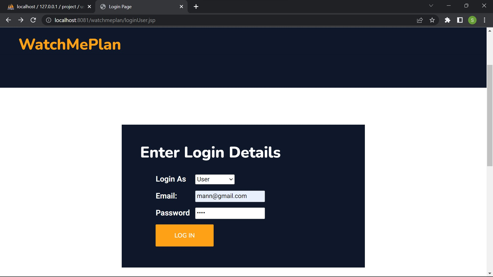
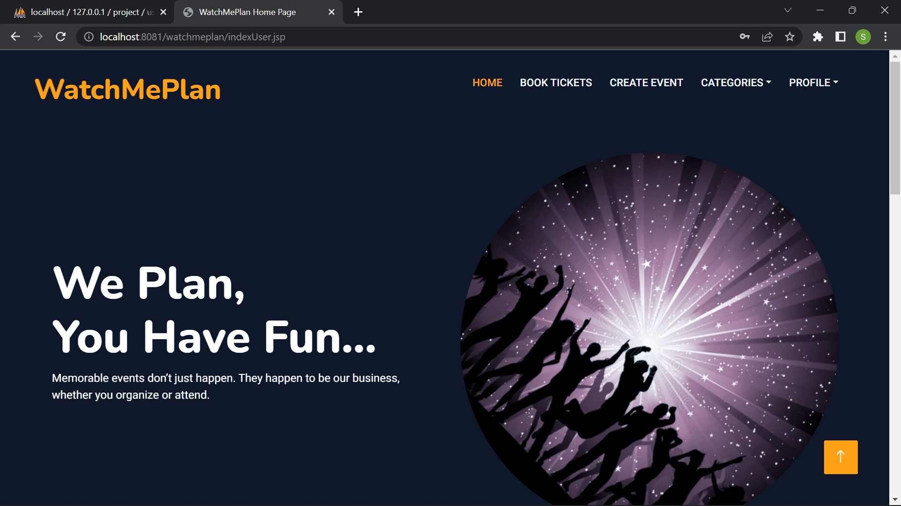
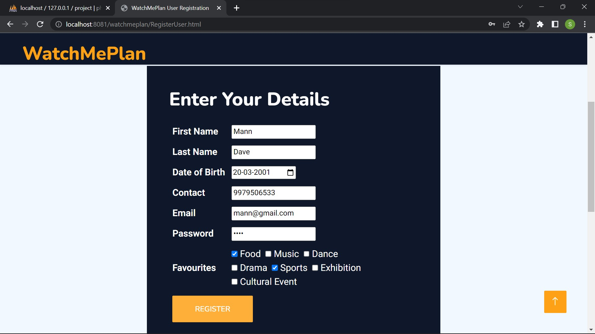
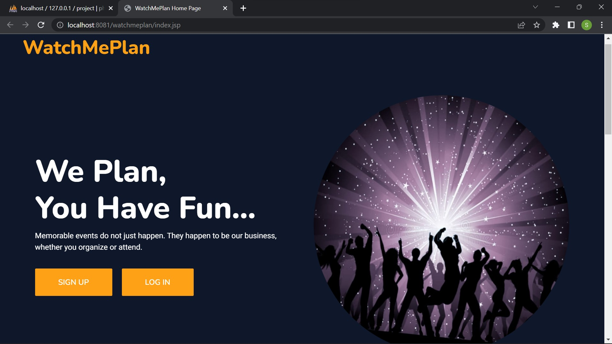
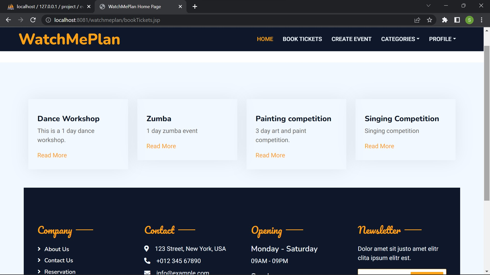
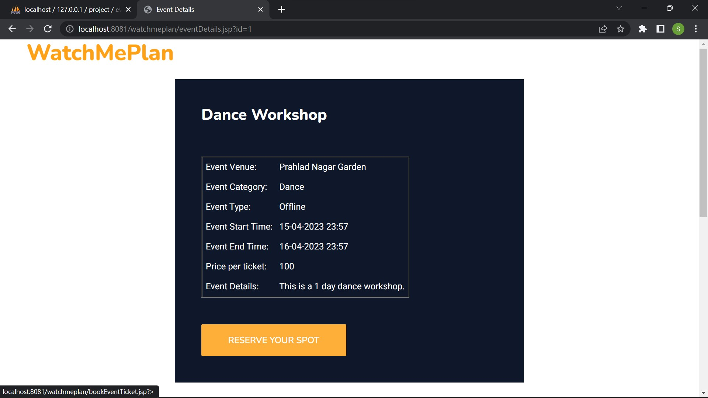
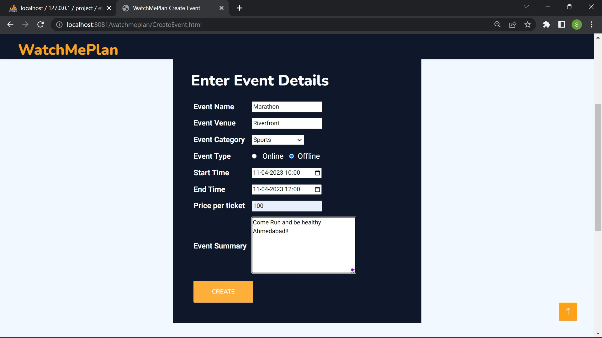
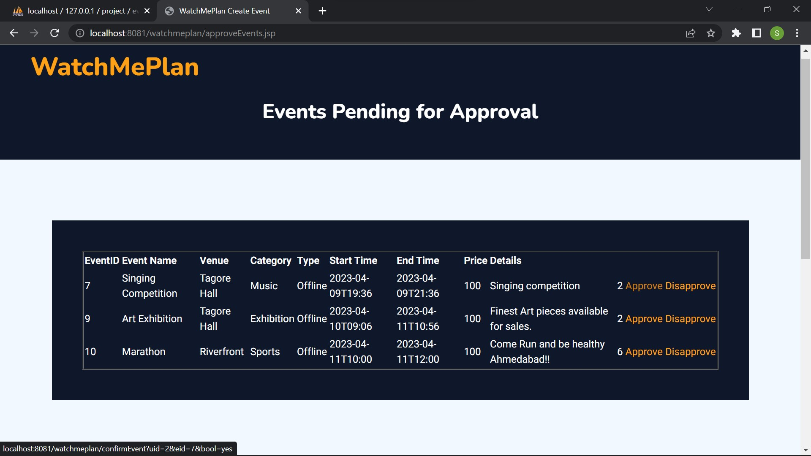
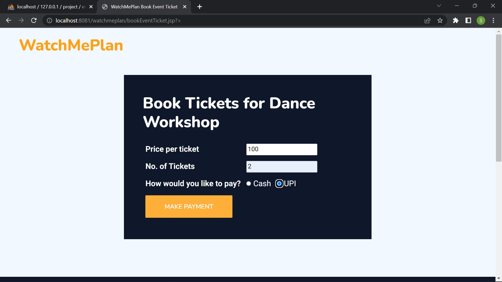
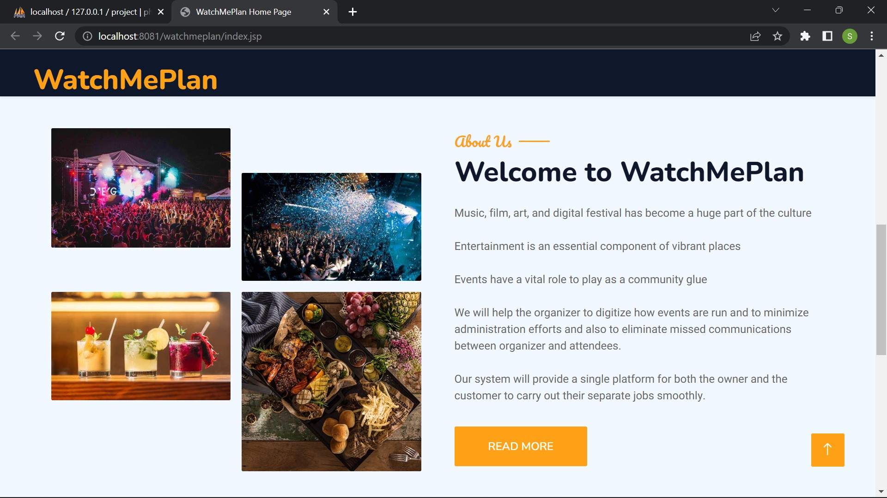

# 🎫 WatchMePlan – A Centralised Event Management Platform


## 📍 Overview

**WatchMePlan** is a centralized **event management platform** designed for both **Event Organizers** and **Attendees**. Think of it as a **BookMyShow**, but tailored for **local events** — including cultural shows, college fests, exhibitions, and community meetups.

This project was inspired by a real-world gap in how local events are marketed and managed.

---

## 💡 Problem It Solves

The traditional system of promoting and managing events is fragmented and inefficient.
**WatchMePlan** addresses key pain points:

- ❌ Events are often missed by potential attendees due to lack of exposure.
- ❌ Organizers struggle with expensive or ineffective marketing.
- ❌ Unfair ticket pricing and lack of transparency.
- ❌ Cumbersome registration and booking process.
- ❌ No centralized portal for local events.

**WatchMePlan** solves this by offering a digital, streamlined solution for both parties.

---

## 🛠 Tech Stack

| Layer       | Technology         |
|------------|--------------------|
| Frontend    | Bootstrap (HTML/CSS/JS) |
| Backend     | Java (JSP & Servlets)   |
| Database    | MySQL             |

---

## 🔐 Features

- ✅ **Role-Based User Authentication** (Admin & User)
- ✅ **User Registration and Login**
- ✅ **Event Creation** by Organizer
- ✅ **Event Approval** by Admin
- ✅ **View Approved Events**
- ✅ **Categorized Event Browsing**
- ✅ **Ticket Booking**
- ✅ **User Profile Management**

---

## 👥 User Roles

### 🎟 Attendee / User
- View and browse upcoming events
- Book tickets
- Manage profile

### 🧑‍💼 Organizer
- Create events
- View approval status
- Track bookings

### 🛡 Admin
- Approve or reject events
- Monitor bookings and users
- Manage platform operations

---

## 📸 Screenshots

> A visual walkthrough of the core features of **WatchMePlan**:

<table>
  <tr>
    <td align="center"><strong>Login Page</strong></td>
    <td align="center"><strong>Home Page</strong></td>
  </tr>
  <tr>
    <td></td>
    <td></td>
  </tr>
  
  <tr><td colspan="2"><br/></td></tr>

  <tr>
    <td align="center"><strong>Registration Page</strong></td>
    <td align="center"><strong>User Dashboard</strong></td>
  </tr>
  <tr>
    <td></td>
    <td></td>
  </tr>
  
  <tr><td colspan="2"><br/></td></tr>

  <tr>
    <td align="center"><strong>Events Listing</strong></td>
    <td align="center"><strong>Event Details</strong></td>
  </tr>
  <tr>
    <td></td>
    <td></td>
  </tr>
  
  <tr><td colspan="2"><br/></td></tr>

  <tr>
    <td align="center"><strong>Event Creation</strong></td>
    <td align="center"><strong>Event Approval (Admin)</strong></td>
  </tr>
  <tr>
    <td></td>
    <td></td>
  </tr>

  <tr><td colspan="2"><br/></td></tr>

  <tr>
    <td align="center"><strong>Ticket Booking</strong></td>
    <td align="center"><strong>About Us Page</strong></td>
  </tr>
  <tr>
    <td></td>
    <td></td>
  </tr>
</table>

---

## 🚀 How to Run the Project

### ✅ Prerequisites:
- JDK 8 or higher
- Apache Tomcat 9.x
- MySQL 5.7+
- IDE (Eclipse / IntelliJ / NetBeans)

### 🔧 Setup Steps:

### Import the Project
1. Open Eclipse or your preferred IDE.
2. Navigate to **File → Import → Dynamic Web Project**.
3. Select the project folder containing `WatchMePlan`.
4. Click **Finish** to import the project.

### Configure Apache Tomcat Server
1. Add Tomcat runtime to Eclipse:
   - Go to **Window → Preferences → Server → Runtime Environments**.
   - Add a new Apache Tomcat server and configure the installation directory.
2. Right-click on the project in Eclipse → **Properties → Targeted Runtimes**.
3. Select the configured Tomcat server and click **Apply and Close**.

### Setup MySQL Database
1. Open MySQL Workbench or your preferred database client.
2. Create a new database:
   ```sql
   CREATE DATABASE watchmeplan_db;
3. If a .sql file is provided, import it into the watchmeplan_db database to set up the schema and initial data.

### Configure Database Credentials
1. Locate the database utility or connection file in the project (e.g., DBConnection.java).
2. Update the database connection details:
- Database URL: jdbc:mysql://localhost:3306/watchmeplan_db
- Username: Your MySQL username
- Password: Your MySQL password

### Run the Project
1. Right-click the project in Eclipse → Run As → Run on Server.
2. Select the configured Tomcat server and start it.
3. Open a browser and navigate to: **http://localhost:8080/WatchMePlan**
